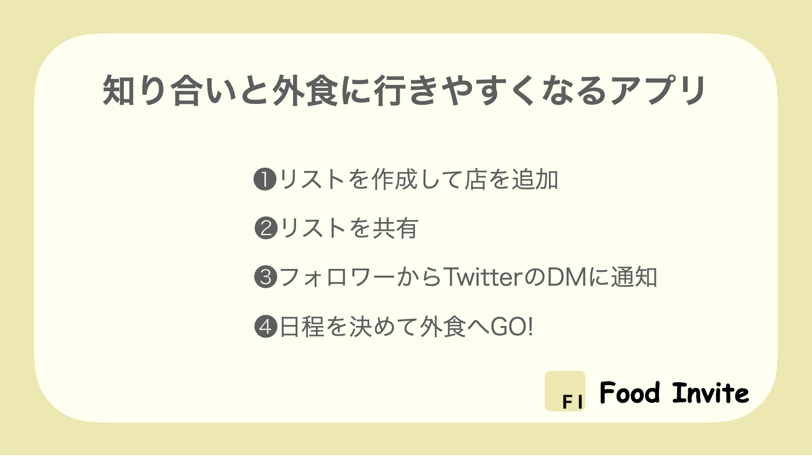
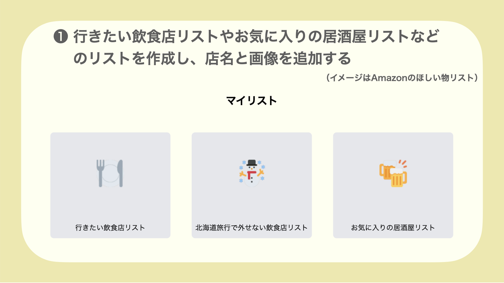
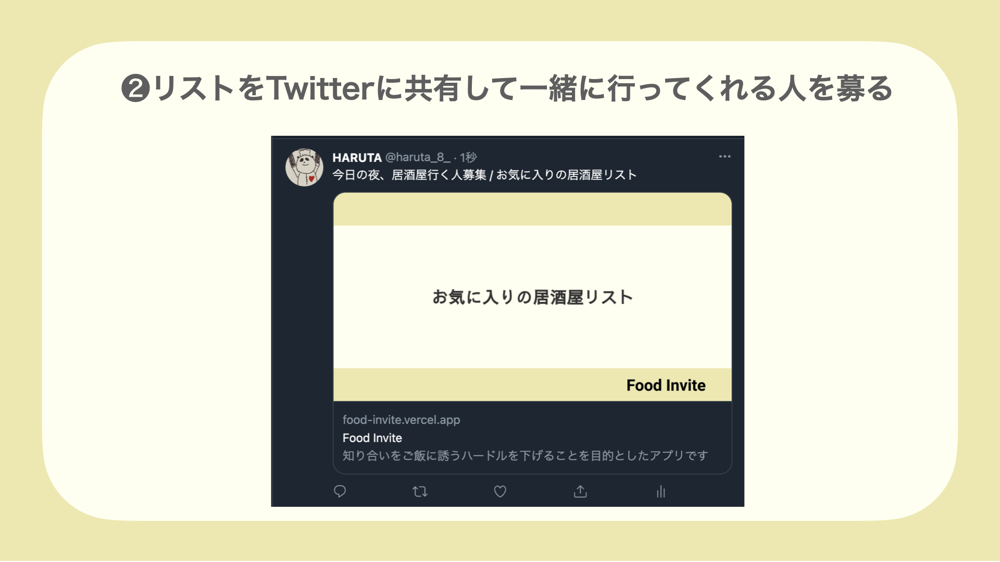
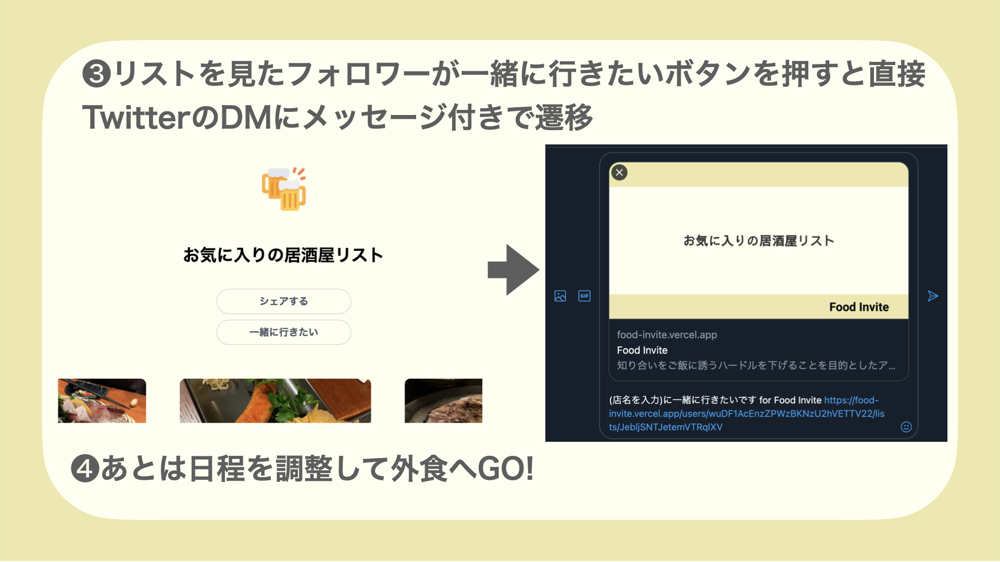

# Food Invite

## 概要

https://food-invite.vercel.app/  
知り合いと外食に行きやすくなるアプリ 

## 開発した経緯

・Twitter で『今日の夜ご飯行きませんか？』とつぶやいて誰からもリプがなかったら悲しい＆誰かがリプしていたらもう追加でリプしにくい 
・Twitter でフォローし合っているがあまり親交がない人と一緒にご飯に行って話を聞きたい 
・友達とご飯に行く際、食べに行く店がなかなか決まらない 
・外食の際、食べログで上位の店に行くのではなく、知り合いがお勧めする店に行きたい＆知り合いのおすすめの店を知りたい 

上記の問題を解決したい 

## 主な機能

## これから実装予定の機能

・共同編集でみんなでリストを作成できます（例えば鹿児島旅行のときに外せないとんかつ屋さんのリストに対して店追加のリクエストができる） 
・都道府県ごとにリスト、お店を検索できます（旅行先のご飯を決めるときは Food Invite で検索！） 
